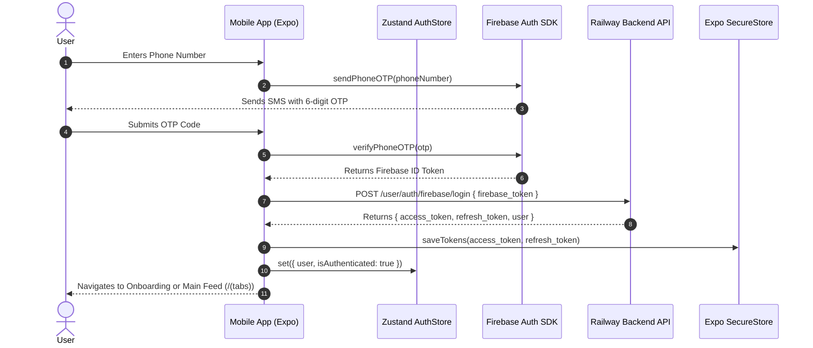

# 🏛️ SYSTEM ARCHITECTURE & SYSTEM DECOMPOSITION

> **Project**: Hyperlocal News & Community Engagement Frontend  
> **Repository**: `Sujana2004/hyperlocal-news-frontend`  

---

## 1. High-Level Architecture Diagram

```
┌────────────────────────────────────────────────────────────────────────────────────────┐
│                                USER MOBILE APPLICATION                                 │
│                                (React Native / Expo v52)                               │
│                                                                                        │
│  ┌──────────────────────────────────────────────────────────────────────────────────┐  │
│  │                              PRESENTATION LAYER                                  │  │
│  │                                                                                  │  │
│  │  ┌──────────────────┐  ┌───────────────────┐  ┌────────────────────────────────┐  │  │
│  │  │ Navigation Stack │  │ Tab Screens       │  │ Atomic UI Components           │  │  │
│  │  │ (Expo Router v4) │  │ (Index, Shorts,   │  │ (Button, Card, Badge, Modal,   │  │  │
│  │  │                  │  │  Discover, Profile│  │  ImmersiveNewsCard, Header)    │  │  │
│  │  └────────┬─────────┘  └─────────┬─────────┘  └───────────────┬────────────────┘  │  │
│  └───────────┼──────────────────────┼────────────────────────────┼──────────────────┘  │
│              │                      │                            │                     │
│  ┌───────────▼──────────────────────▼────────────────────────────▼──────────────────┐  │
│  │                              APPLICATION STATE LAYER                             │  │
│  │                                                                                  │  │
│  │  ┌───────────────────────────┐                ┌───────────────────────────────┐  │  │
│  │  │ Modular Zustand Stores    │                │ TanStack React Query Cache    │  │  │
│  │  │ - useAuthStore            │                │ - News Feed Cache (5m Stale)  │  │  │
│  │  │ - useStore (Bookmarks)    │                │ - Categories & Location Cache │  │  │
│  │  │ - useTabBarStore          │                │ - Posts & Comments Cache      │  │  │
│  │  └────────┬──────────────────┘                └───────────────┬───────────────┘  │  │
│  └───────────┼───────────────────────────────────────────────────┼──────────────────┘  │
│              │                                                   │                     │
│  ┌───────────▼───────────────────────────────────────────────────▼──────────────────┐  │
│  │                               SERVICES & NETWORK LAYER                           │  │
│  │                                                                                  │  │
│  │  ┌─────────────────────────┐ ┌─────────────────────────┐ ┌──────────────────────┐  │  │
│  │  │ Axios Client Interceptor│ │ Firebase Native Auth    │ │ Supabase JS Client   │  │  │
│  │  │ - Bearer Token Auth     │ │ - Phone OTP SDK         │ │ - Base64 Image Upload│  │  │
│  │  │ - Auto Token Refresh 401│ │ - Google Sign-In SDK    │ │ - Public Media Bucket│  │  │
│  │  └────────┬────────────────┘ └────────────┬────────────┘ └──────────┬───────────┘  │  │
│  └───────────┼───────────────────────────────┼─────────────────────────┼──────────────┘  │
└──────────────┼───────────────────────────────┼─────────────────────────┼─────────────────┘
               │                               │                         │
               │ (REST API / Bearer JWT)       │ (Firebase IdToken)      │ (HTTP Multipart)
┌──────────────▼───────────────────────────────▼─────────────────────────▼─────────────────┐
│                              BACKEND INFRASTRUCTURE                                    │
│                                                                                        │
│  ┌──────────────────────────────────────────────┐   ┌───────────────────────────────┐  │
│  │ Microservices API Gateway                    │   │ Supabase Cloud Storage        │  │
│  │ Endpoint: hypernews-production.up.railway.app│   │ Bucket: `new-images`          │  │
│  └──────────────────────────────────────────────┘   └───────────────────────────────┘  │
└────────────────────────────────────────────────────────────────────────────────────────┘
```

---

## 2. Layer-by-Layer Decomposition

### A. Navigation & Presentation Layer (`app/`, `components/`)
- **Expo Router (v4.0)**: Provides nested file-based route definitions with automatic typed route generation (`app/_layout.tsx`, `app/(auth)/`, `app/(onboarding)/`, `app/(tabs)/`, `app/(publisher)/`, `app/news/[id].tsx`).
- **Custom Design Tokens**: UI components pull strictly from unified design system constants:
  - `Colors.ts`: Tailored light (`#F8F9FF` background) and dark (`#12121A` background) palettes anchored by primary indigo (`#4648D4`).
  - `Spacing.ts`: Standardized padding and margin scale (`xs: 4`, `sm: 8`, `md: 16`, `lg: 24`, `xl: 32`).
  - `Typography.ts`: Global text styling using Google Poppins (`400Regular`, `500Medium`, `600SemiBold`, `700Bold`).

### B. State Management Layer (`store/`)
- **`useAuthStore`** ([authStore.ts](file:///c:/A/hyperlocal-news-frontend/store/authStore.ts)): Tracks authentication status, current user profile (`User`), onboarding step preferences, and app theme settings. Uses Zustand's `persist` middleware backed by `AsyncStorage`.
- **`useStore`** ([useStore.ts](file:///c:/A/hyperlocal-news-frontend/store/useStore.ts)): Manages local article bookmark IDs and community publisher request application status.
- **`useTabBarStore`** ([tabBarStore.ts](file:///c:/A/hyperlocal-news-frontend/store/tabBarStore.ts)): Maintains visible/hidden state for the bottom navigation tab bar.

### C. Data & Query Layer (`hooks/`)
- **TanStack React Query**: Intercepts server state fetching, provides instant cache retrieval, handles background refetching, and manages optimistic mutation updates (`useNews.ts`, `usePosts.ts`, `useEngagement.ts`, `useDiscovery.ts`).
- **Feed Algorithm Helper** (`feedInjection.ts`): Blends raw news articles, active advertisements, and neighborhood polls into a single structured feed list for rendering.

### D. Integration & Network Services Layer (`services/`)
- **Axios HTTP Client** (`services/api/client.ts`): Handles base URL configuration, request timeout enforcement, automatic `Bearer <access_token>` header injection, and seamless HTTP 401 token refresh queueing.
- **Token Manager** (`services/api/token.ts`): Reads and writes encrypted JWT tokens (`auth_token`, `refresh_token`) to `expo-secure-store`.
- **Firebase Auth Service** (`services/firebase.ts`): Wraps `@react-native-firebase/auth` for native SMS verification code delivery, OTP confirmation, and Google OAuth sign-in.
- **Supabase Storage Service** (`services/supabase.ts`): Encapsulates image compression and Base64 buffer upload to Supabase storage buckets (`new-images`), returning public CDN URLs for user avatars and published news images.

---

## 3. Data & Authentication Sequence Diagram


